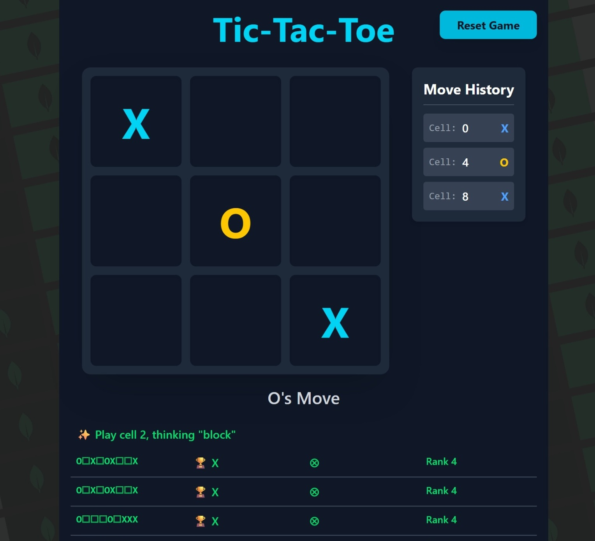
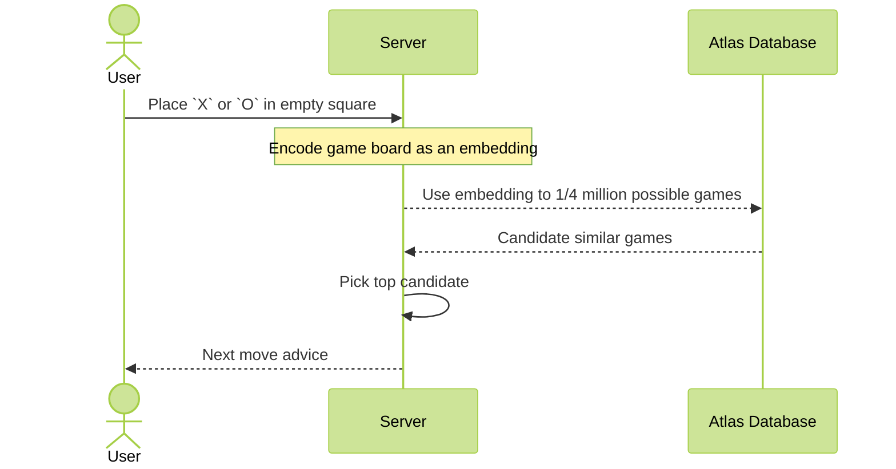

# Vec Tac Toe - A Vector Search Game

This application demonstrates using vector search for getting tic-tac-toe next move advice.



## How Does it Work?

The application uses a database that store all possible final game board states, alongside the winner of that game.

For each game, an _embedding_ is created from the board state, which is play-sequence sensitive.

The game engine locates a board similar to the current board state using Atlas Vector Search, by creating an embedding from the plays made thus far, then finding candidates.
Candidates are ranked and picked based on:

1.If a winning board can be reached for the current player
1.If an opponent winning board can be foiled
1.If no possible win or block move can be made, and empty cell is chosen at random

> There are better ways to absolutely guarantee a win in this game than using vector search. But are they fun?




## Usage

The app is written in JavaScript and TypeScript.

It was developed using the [Bun](https://bun.sh/) runtime. Other runtimes might work, but not tested.

The application uses MongoDB Atlas.

### Installation

Install the dependencies

```shell
bun install
```

Generate a dataset

```shell
bun ./dataset-cli.js --save
```

The above generates a local file with a dump of all possible boards that end up in a win or tie.

To upload the dataset to MongoDB, you must first set the environment variable `VECTACTOE_MONGO_URL` to the URL of your atlas cluster (see below for local setup).

Make sure to have a database name at the end of the url. For example `https://<credentials>@cluster1.abcd.mongodb.net/mydb` would be using the `mydb` database on your cluster. The collection is hard coded to `vec_tac_toe`.

Upload the data to your collection

```shell
bun ./dataset-cli.js --upload --load
```

> `--load` reads the stored dataset and avoids re-computing all possible plays. If you omit `--load`, the program will generate the data on the fly and then upload.

Create a vector search index

```shell
bun ./dataset-cli.js --idx
```

Attempt a vector query

```shell
bun ./dataset-cli.js --query
```

### Running the Application

The application is fully contained built with React and Bun.

Run it using:

```bash
bun run dev
```

Navigate to <http://localhost:3000/> and play the game!

### Other CLI options

The cli now prompts you to enter a sequence of comma separated cells played thus far. The cell numbers correspond to the board:

```text
0 1 2
3 4 5
6 7 8
```

The sequence `4,2,0,8` is describing that the board right now is:

```text
X _ O
_ X _
_ _ O
```

The program will use this play sequence to dig up compatible plays that resulted in a win or tie, favoring the current player winning.

It does so by composing a vector search query over stored legal game plays, then attempting to identify best move among results.

## Local Atlas Setup
If you want to run the application locally, you can use the following docker container:
mongodb/mongodb-atlas-local:8.0

.e.g.
```shell
docker run -p 27017:27017 mongodb/mongodb-atlas-local:8.0
```

You can then connect to it by setting the environment variable with the connection string:
```shell
export VECTACTOE_MONGO_URL="mongodb://localhost:27017/VecTacToe?directConnection=true"
``` 


### Atlas Local Docker Compose for Persistence
You can also use the included docker-compose file to run Atlas Local.

```shell
docker compose up -d
```
This will start Atlas Local, and keep the data when stopped or started.

You can then connect to it by setting the environment variable with the connection string:
```shell
export VECTACTOE_MONGO_URL="mongodb://localhost:27017/VecTacToe?directConnection=true"
```

If you are on a Mac using ZSH you can also add the above line to your `.zshrc` file to make it permanent:
```shell
echo 'export VECTACTOE_MONGO_URL="mongodb://localhost:27017/VecTacToe?directConnection=true"' >> ~/.zshrc
```
